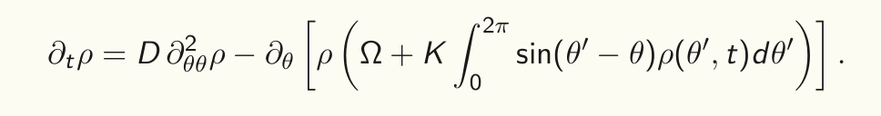

# First-order Kuramoto Model Simulator

This project is a numerical simulator for the first order, mean field Kuramoto PDE with identical oscillators



---
## Model

The equation describes the evolution of the density function,  with:

- θ : phase variable
- t : time variable
- D : noise coefficient
- Ω : natural frequency  
- K : coupling strength  

---
##  Description

The simulator allows the user to:
- configure system parameters (initial conditions, coupling, noise, etc.)
- run numerical simulations of the Kuramoto dynamics
- save simulation results for post processing and visualization
- data visualization of the results
---


## Data visualization

The simulation produces the solution of the PDE that can be used to visualize:
- synchronization dynamics
- order parameter evolution (to be implemented soon)
- phase distributions (to be implemented soon)

---

##  How to build and run

###  Requirements

- C++ compiler (e.g. `g++`, `clang++`, MSVC)
- CMake (>= 3.10)
- Python >= 3.8 with numpy and matplotlib

---

###  Build

Clone the repository:

```bash
git clone https://github.com/giulioPecorella98/First-order-Kuramoto-1.git
```

Set building directories:

```bash
cd First-order-Kuramoto-1
mkdir build
cd build
```

On Linux systems:
```bash
cmake ..
cmake --build .
```

On Windows, you need to specify a generator (e.g. MinGW):

```bash
cmake -G "MinGW Makefiles" ..
cmake --build .
```


Run

```bash
./main.py
```


---


## Notes

This is a numerical implementation for research/educational purposes.
